# MediCare: Clinic Management & Appointment System
## 4. System Analysis & Design

**Program:** DEPI | **Deadline:** 6 Nov 2026

All diagrams are written in Mermaid, so GitHub shows them as drawings.

---

# 1. Problem Statement, Requirements and Architecture

## 1.1 Problem Statement & Objectives
The problem statement, objectives and scope are in `1-Project-Planning-and-Management.md` (section 1.1).

## 1.2 Functional & Non-Functional Requirements
The full requirements are in `3-Requirements-Gathering.md` (sections 3.4 and 3.5).

## 1.3 Use Case Diagram

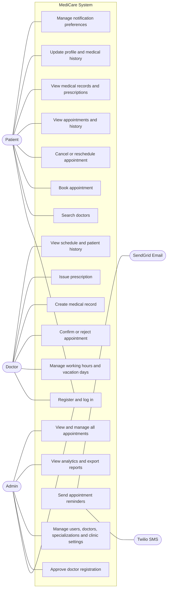
```mermaid
flowchart LR
    Patient([Patient])
    Doctor([Doctor])
    Admin([Admin])
    Sms([Twilio SMS])
    Mail([SendGrid Email])

    subgraph sys ["MediCare System"]
        UC1["Register and log in"]
        UC2["Search doctors"]
        UC3["Book appointment"]
        UC4["Cancel or reschedule appointment"]
        UC5["View appointments and history"]
        UC6["View medical records and prescriptions"]
        UC7["Update profile and medical history"]
        UC8["Manage notification preferences"]
        UC9["Manage working hours and vacation days"]
        UC10["Confirm or reject appointment"]
        UC11["Create medical record"]
        UC12["Issue prescription"]
        UC13["Approve doctor registration"]
        UC14["Manage users, doctors, specializations and clinic settings"]
        UC15["View analytics and export reports"]
        UC16["Send appointment reminders"]
        UC17["View schedule and patient history"]
        UC18["View and manage all appointments"]
    end

    Patient --- UC1
    Patient --- UC2
    Patient --- UC3
    Patient --- UC4
    Patient --- UC5
    Patient --- UC6
    Patient --- UC7
    Patient --- UC8
    Doctor --- UC1
    Doctor --- UC9
    Doctor --- UC10
    Doctor --- UC11
    Doctor --- UC12
    Doctor --- UC17
    Admin --- UC1
    Admin --- UC13
    Admin --- UC14
    Admin --- UC15
    Admin --- UC18
    UC16 --- Sms
    UC16 --- Mail
```

The detailed descriptions of the main use cases (UC-01 to UC-05) are in `3-Requirements-Gathering.md` (section 3.3).

## 1.4 Software Architecture

MediCare uses the **MVC** pattern inside an **N-Tier** architecture. The code is split into three layers, and each layer only talks to the layer below it.

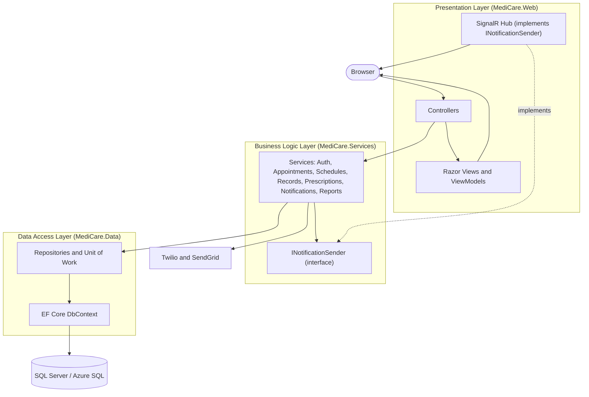
```mermaid
flowchart TB
    User([Browser])

    subgraph Web ["Presentation Layer (MediCare.Web)"]
        Ctrl["Controllers"]
        View["Razor Views and ViewModels"]
        Hub["SignalR Hub (implements INotificationSender)"]
    end

    subgraph BLL ["Business Logic Layer (MediCare.Services)"]
        Svc["Services: Auth, Appointments, Schedules, Records, Prescriptions, Notifications, Reports"]
        Iface["INotificationSender (interface)"]
    end

    subgraph DAL ["Data Access Layer (MediCare.Data)"]
        Repo["Repositories and Unit of Work"]
        Ctx["EF Core DbContext"]
    end

    DB[("SQL Server / Azure SQL")]
    Ext["Twilio and SendGrid"]

    User --> Ctrl
    Ctrl --> View
    View --> User
    Ctrl --> Svc
    Svc --> Iface
    Hub -.->|implements| Iface
    Hub --> User
    Svc --> Repo
    Repo --> Ctx
    Ctx --> DB
    Svc --> Ext
```

**Patterns used:** Repository, Unit of Work, Factory (appointment and notification types) and Dependency Injection.

**Layering rule:** `MediCare.Services` never references `MediCare.Web`. Real-time notifications go through the `INotificationSender` interface defined in Services, and the SignalR Hub in Web implements it (Dependency Injection).

---

# 2. Database Design & Data Modeling

## 2.1 ER Diagram

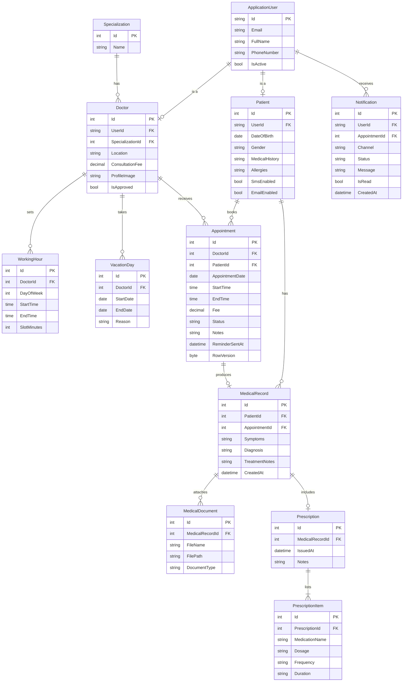
```mermaid
erDiagram
    ApplicationUser ||--o| Doctor : "is a"
    ApplicationUser ||--o| Patient : "is a"
    ApplicationUser ||--o{ Notification : receives
    Specialization ||--o{ Doctor : has
    Doctor ||--o{ WorkingHour : sets
    Doctor ||--o{ VacationDay : takes
    Doctor ||--o{ Appointment : receives
    Patient ||--o{ Appointment : books
    Patient ||--o{ MedicalRecord : has
    Appointment ||--o| MedicalRecord : produces
    MedicalRecord ||--o{ MedicalDocument : attaches
    MedicalRecord ||--o| Prescription : includes
    Prescription ||--|{ PrescriptionItem : lists

    ApplicationUser {
        string Id PK
        string Email
        string FullName
        string PhoneNumber
        bool IsActive
    }
    Specialization {
        int Id PK
        string Name
    }
    Doctor {
        int Id PK
        string UserId FK
        int SpecializationId FK
        string Location
        decimal ConsultationFee
        string ProfileImage
        bool IsApproved
    }
    Patient {
        int Id PK
        string UserId FK
        date DateOfBirth
        string Gender
        string MedicalHistory
        string Allergies
        bool SmsEnabled
        bool EmailEnabled
    }
    WorkingHour {
        int Id PK
        int DoctorId FK
        int DayOfWeek
        time StartTime
        time EndTime
        int SlotMinutes
    }
    VacationDay {
        int Id PK
        int DoctorId FK
        date StartDate
        date EndDate
        string Reason
    }
    Appointment {
        int Id PK
        int DoctorId FK
        int PatientId FK
        date AppointmentDate
        time StartTime
        time EndTime
        decimal Fee
        string Status
        string Notes
        datetime ReminderSentAt
        byte RowVersion
    }
    MedicalRecord {
        int Id PK
        int PatientId FK
        int AppointmentId FK
        string Symptoms
        string Diagnosis
        string TreatmentNotes
        datetime CreatedAt
    }
    MedicalDocument {
        int Id PK
        int MedicalRecordId FK
        string FileName
        string FilePath
        string DocumentType
    }
    Prescription {
        int Id PK
        int MedicalRecordId FK
        datetime IssuedAt
        string Notes
    }
    PrescriptionItem {
        int Id PK
        int PrescriptionId FK
        string MedicationName
        string Dosage
        string Frequency
        string Duration
    }
    Notification {
        int Id PK
        string UserId FK
        int AppointmentId FK
        string Channel
        string Status
        string Message
        bool IsRead
        datetime CreatedAt
    }
```

## 2.2 Logical Schema

`PK` marks a primary key and `FK -> Table` marks a foreign key.

- **ApplicationUser**(Id PK, Email, FullName, PhoneNumber, IsActive). Roles (Patient, Doctor, Admin) are stored in the standard ASP.NET Identity role tables.
- **Specialization**(Id PK, Name)
- **Doctor**(Id PK, UserId FK -> ApplicationUser, SpecializationId FK -> Specialization, Location, ConsultationFee, ProfileImage, IsApproved)
- **Patient**(Id PK, UserId FK -> ApplicationUser, DateOfBirth, Gender, MedicalHistory, Allergies, SmsEnabled, EmailEnabled)
- **WorkingHour**(Id PK, DoctorId FK -> Doctor, DayOfWeek, StartTime, EndTime, SlotMinutes)
- **VacationDay**(Id PK, DoctorId FK -> Doctor, StartDate, EndDate, Reason)
- **Appointment**(Id PK, DoctorId FK -> Doctor, PatientId FK -> Patient, AppointmentDate, StartTime, EndTime, Fee, Status, Notes, ReminderSentAt, RowVersion)
- **MedicalRecord**(Id PK, PatientId FK -> Patient, AppointmentId FK -> Appointment, Symptoms, Diagnosis, TreatmentNotes, CreatedAt)
- **MedicalDocument**(Id PK, MedicalRecordId FK -> MedicalRecord, FileName, FilePath, DocumentType)
- **Prescription**(Id PK, MedicalRecordId FK -> MedicalRecord, IssuedAt, Notes)
- **PrescriptionItem**(Id PK, PrescriptionId FK -> Prescription, MedicationName, Dosage, Frequency, Duration)
- **Notification**(Id PK, UserId FK -> ApplicationUser, AppointmentId FK -> Appointment (optional), Channel, Status, Message, IsRead, CreatedAt)

## 2.3 Physical Schema (SQL Server)

The tables are created by EF Core migrations. The most important table, `Appointment`, looks like this:

```sql
CREATE TABLE Appointment (
    Id              INT IDENTITY(1,1) PRIMARY KEY,
    DoctorId        INT           NOT NULL REFERENCES Doctor(Id),
    PatientId       INT           NOT NULL REFERENCES Patient(Id),
    AppointmentDate DATE          NOT NULL,
    StartTime       TIME          NOT NULL,
    EndTime         TIME          NOT NULL,
    Fee             DECIMAL(10,2) NOT NULL,
    Status          NVARCHAR(20)  NOT NULL DEFAULT 'Pending',
    Notes           NVARCHAR(500) NULL,
    ReminderSentAt  DATETIME2     NULL,
    RowVersion      ROWVERSION
);

-- Blocks two active appointments with the same doctor and start time (cancelled ones are ignored)
CREATE UNIQUE INDEX UX_Appointment_Doctor_Slot
    ON Appointment (DoctorId, AppointmentDate, StartTime)
    WHERE Status <> 'Cancelled';
```

Other physical decisions:
- **Overlap check:** the unique index only catches identical start times, so the booking service also checks that the new slot does not overlap an existing appointment (for example, if the slot length changes).
- **Fee:** the consultation fee is copied into `Appointment.Fee` at booking time, so revenue reports stay correct even if the doctor changes the fee later.
- **Reminders:** `ReminderSentAt` stops the scheduler from sending the same reminder twice.
- Primary keys are `INT IDENTITY`, except `ApplicationUser.Id`, which is a string (ASP.NET Identity).
- Foreign keys have indexes (`DoctorId`, `PatientId`, `UserId`, `SpecializationId`) to keep queries fast.
- Text fields use `NVARCHAR` so Arabic and English data are both supported.
- Uploaded files are stored outside the database, and only `FilePath` is saved.

## 2.4 Normalization

The schema is in **Third Normal Form (3NF)**:
- Each column holds one value (for example, medications are in `PrescriptionItem`, not in a text list inside `Prescription`).
- Doctor specializations are stored once in `Specialization` and referenced by key.
- Working hours and vacation days are separate tables because a doctor has many of them.
- No column depends on another non-key column, with one deliberate exception: `MedicalRecord.PatientId` can also be found through `Appointment`. It is kept so a patient's history can be loaded without a join, and the service must make sure it matches `Appointment.PatientId`. The team can remove it if a strict 3NF is preferred.

---

# 3. Data Flow & System Behavior

## 3.1 Data Flow Diagram: Level 0 (Context)

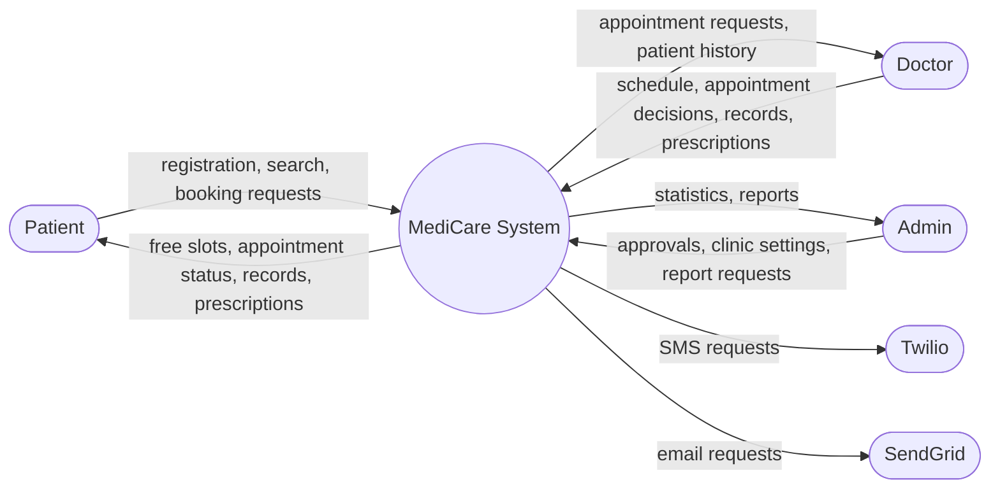
```mermaid
flowchart LR
    Patient([Patient])
    Doctor([Doctor])
    Admin([Admin])
    Twilio([Twilio])
    SendGrid([SendGrid])
    System(("MediCare System"))

    Patient -->|"registration, search, booking requests"| System
    System -->|"free slots, appointment status, records, prescriptions"| Patient
    Doctor -->|"schedule, appointment decisions, records, prescriptions"| System
    System -->|"appointment requests, patient history"| Doctor
    Admin -->|"approvals, clinic settings, report requests"| System
    System -->|"statistics, reports"| Admin
    System -->|"SMS requests"| Twilio
    System -->|"email requests"| SendGrid
```

## 3.2 Data Flow Diagram: Level 1

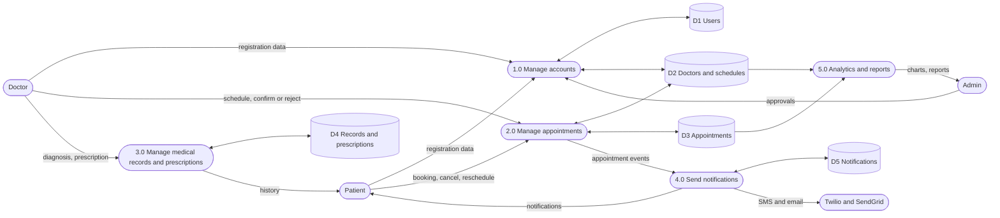
```mermaid
flowchart LR
    Patient([Patient])
    Doctor([Doctor])
    Admin([Admin])
    Ext([Twilio and SendGrid])

    P1(["1.0 Manage accounts"])
    P2(["2.0 Manage appointments"])
    P3(["3.0 Manage medical records and prescriptions"])
    P4(["4.0 Send notifications"])
    P5(["5.0 Analytics and reports"])

    D1[("D1 Users")]
    D2[("D2 Doctors and schedules")]
    D3[("D3 Appointments")]
    D4[("D4 Records and prescriptions")]
    D5[("D5 Notifications")]

    Patient -->|"registration data"| P1
    Doctor -->|"registration data"| P1
    Admin -->|"approvals"| P1
    P1 <--> D1
    P1 <--> D2

    Patient -->|"booking, cancel, reschedule"| P2
    Doctor -->|"schedule, confirm or reject"| P2
    P2 <--> D2
    P2 <--> D3
    P2 -->|"appointment events"| P4

    Doctor -->|"diagnosis, prescription"| P3
    P3 <--> D4
    P3 -->|"history"| Patient

    P4 <--> D5
    P4 -->|"SMS and email"| Ext
    P4 -->|"notifications"| Patient

    D3 --> P5
    D2 --> P5
    P5 -->|"charts, reports"| Admin
```

## 3.3 Sequence Diagrams

### SD-1: Log in

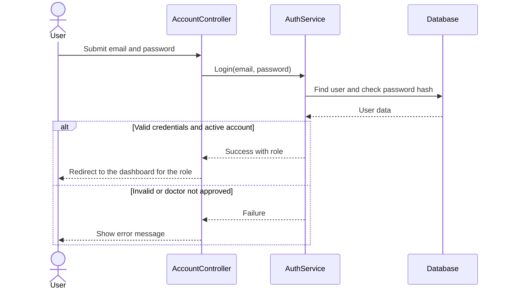
```mermaid
sequenceDiagram
    actor User
    participant Web as AccountController
    participant Svc as AuthService
    participant DB as Database
    User->>Web: Submit email and password
    Web->>Svc: Login(email, password)
    Svc->>DB: Find user and check password hash
    DB-->>Svc: User data
    alt Valid credentials and active account
        Svc-->>Web: Success with role
        Web-->>User: Redirect to the dashboard for the role
    else Invalid or doctor not approved
        Svc-->>Web: Failure
        Web-->>User: Show error message
    end
```

### SD-2: Search doctors and book an appointment

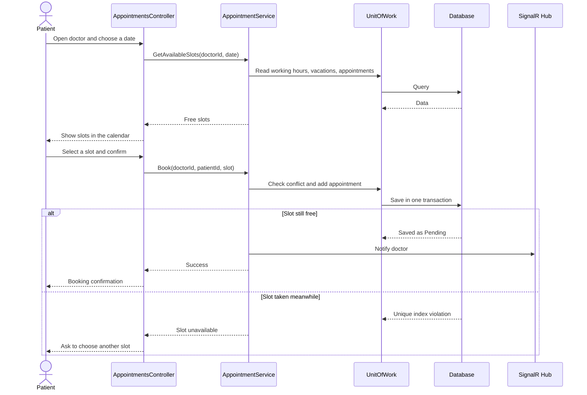
```mermaid
sequenceDiagram
    actor Patient
    participant Web as AppointmentsController
    participant Svc as AppointmentService
    participant UoW as UnitOfWork
    participant DB as Database
    participant Hub as SignalR Hub
    Patient->>Web: Open doctor and choose a date
    Web->>Svc: GetAvailableSlots(doctorId, date)
    Svc->>UoW: Read working hours, vacations, appointments
    UoW->>DB: Query
    DB-->>UoW: Data
    Svc-->>Web: Free slots
    Web-->>Patient: Show slots in the calendar
    Patient->>Web: Select a slot and confirm
    Web->>Svc: Book(doctorId, patientId, slot)
    Svc->>UoW: Check conflict and add appointment
    UoW->>DB: Save in one transaction
    alt Slot still free
        DB-->>UoW: Saved as Pending
        Svc->>Hub: Notify doctor
        Svc-->>Web: Success
        Web-->>Patient: Booking confirmation
    else Slot taken meanwhile
        DB-->>UoW: Unique index violation
        Svc-->>Web: Slot unavailable
        Web-->>Patient: Ask to choose another slot
    end
```

### SD-3: Cancel or reschedule an appointment

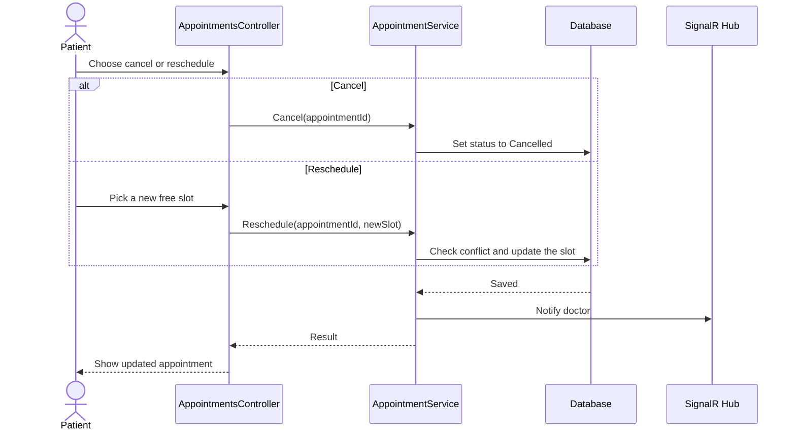
```mermaid
sequenceDiagram
    actor Patient
    participant Web as AppointmentsController
    participant Svc as AppointmentService
    participant DB as Database
    participant Hub as SignalR Hub
    Patient->>Web: Choose cancel or reschedule
    alt Cancel
        Web->>Svc: Cancel(appointmentId)
        Svc->>DB: Set status to Cancelled
    else Reschedule
        Patient->>Web: Pick a new free slot
        Web->>Svc: Reschedule(appointmentId, newSlot)
        Svc->>DB: Check conflict and update the slot
    end
    DB-->>Svc: Saved
    Svc->>Hub: Notify doctor
    Svc-->>Web: Result
    Web-->>Patient: Show updated appointment
```

### SD-4: Confirm or reject an appointment

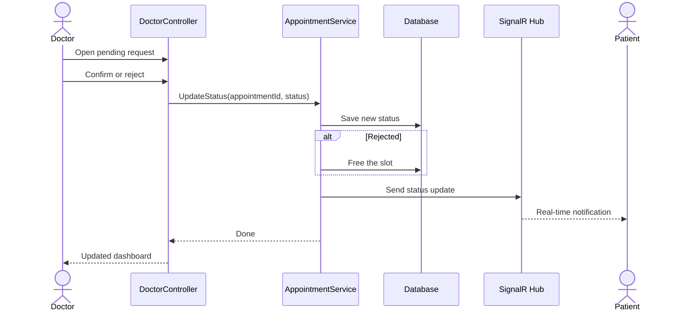
```mermaid
sequenceDiagram
    actor Doctor
    participant Web as DoctorController
    participant Svc as AppointmentService
    participant DB as Database
    participant Hub as SignalR Hub
    actor Patient
    Doctor->>Web: Open pending request
    Doctor->>Web: Confirm or reject
    Web->>Svc: UpdateStatus(appointmentId, status)
    Svc->>DB: Save new status
    alt Rejected
        Svc->>DB: Free the slot
    end
    Svc->>Hub: Send status update
    Hub-->>Patient: Real-time notification
    Svc-->>Web: Done
    Web-->>Doctor: Updated dashboard
```

### SD-5: Create a medical record and prescription

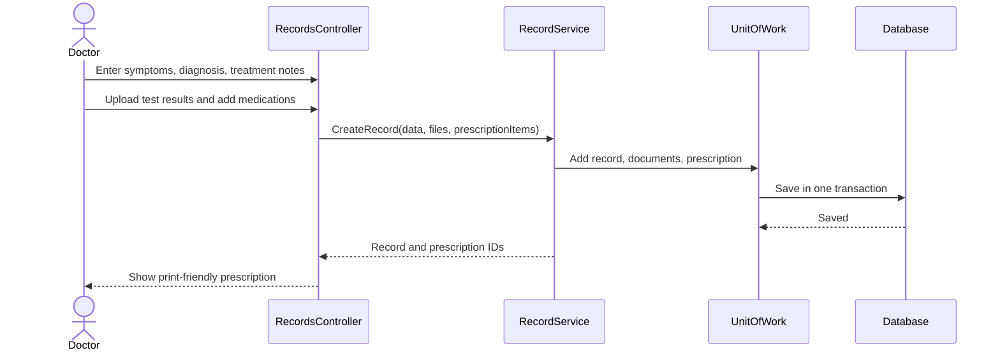
```mermaid
sequenceDiagram
    actor Doctor
    participant Web as RecordsController
    participant Svc as RecordService
    participant UoW as UnitOfWork
    participant DB as Database
    Doctor->>Web: Enter symptoms, diagnosis, treatment notes
    Doctor->>Web: Upload test results and add medications
    Web->>Svc: CreateRecord(data, files, prescriptionItems)
    Svc->>UoW: Add record, documents, prescription
    UoW->>DB: Save in one transaction
    DB-->>UoW: Saved
    Svc-->>Web: Record and prescription IDs
    Web-->>Doctor: Show print-friendly prescription
```

### SD-6: Approve a doctor registration

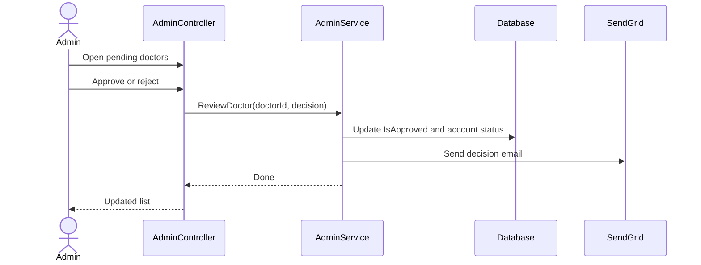
```mermaid
sequenceDiagram
    actor Admin
    participant Web as AdminController
    participant Svc as AdminService
    participant DB as Database
    participant Mail as SendGrid
    Admin->>Web: Open pending doctors
    Admin->>Web: Approve or reject
    Web->>Svc: ReviewDoctor(doctorId, decision)
    Svc->>DB: Update IsApproved and account status
    Svc->>Mail: Send decision email
    Svc-->>Web: Done
    Web-->>Admin: Updated list
```

### SD-7: Send an appointment reminder (24 hours before)

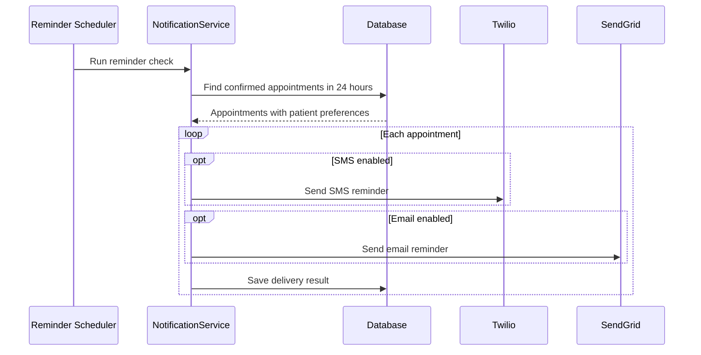
```mermaid
sequenceDiagram
    participant Job as Reminder Scheduler
    participant Svc as NotificationService
    participant DB as Database
    participant SMS as Twilio
    participant Mail as SendGrid
    Job->>Svc: Run reminder check
    Svc->>DB: Find confirmed appointments in 24 hours
    DB-->>Svc: Appointments with patient preferences
    loop Each appointment
        opt SMS enabled
            Svc->>SMS: Send SMS reminder
        end
        opt Email enabled
            Svc->>Mail: Send email reminder
        end
        Svc->>DB: Save delivery result
    end
```

## 3.4 Activity Diagram: Book an appointment

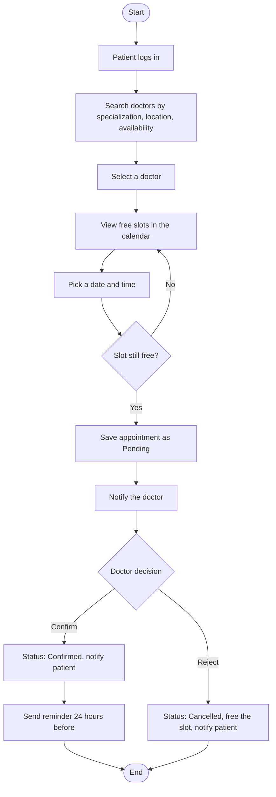
```mermaid
flowchart TD
    Start([Start]) --> Login["Patient logs in"]
    Login --> Search["Search doctors by specialization, location, availability"]
    Search --> Select["Select a doctor"]
    Select --> Slots["View free slots in the calendar"]
    Slots --> Pick["Pick a date and time"]
    Pick --> Check{"Slot still free?"}
    Check -- No --> Slots
    Check -- Yes --> Save["Save appointment as Pending"]
    Save --> NotifyDoc["Notify the doctor"]
    NotifyDoc --> Decision{"Doctor decision"}
    Decision -- Confirm --> Confirmed["Status: Confirmed, notify patient"]
    Decision -- Reject --> Rejected["Status: Cancelled, free the slot, notify patient"]
    Confirmed --> Reminder["Send reminder 24 hours before"]
    Reminder --> End([End])
    Rejected --> End
```

## 3.5 State Diagrams

### Appointment states

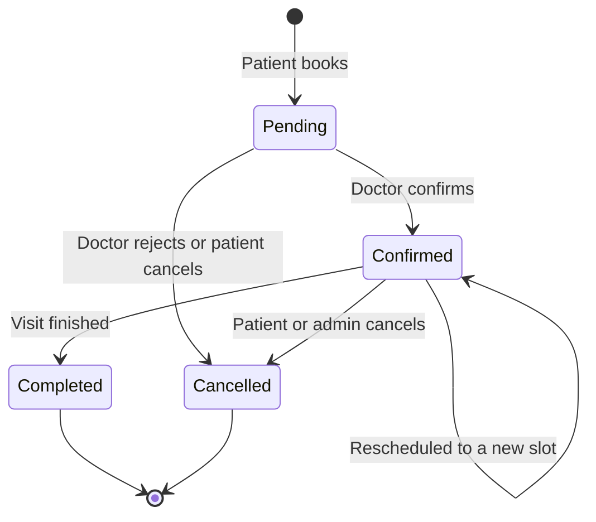
```mermaid
stateDiagram-v2
    [*] --> Pending : Patient books
    Pending --> Confirmed : Doctor confirms
    Pending --> Cancelled : Doctor rejects or patient cancels
    Confirmed --> Cancelled : Patient or admin cancels
    Confirmed --> Confirmed : Rescheduled to a new slot
    Confirmed --> Completed : Visit finished
    Completed --> [*]
    Cancelled --> [*]
```

### Doctor account states

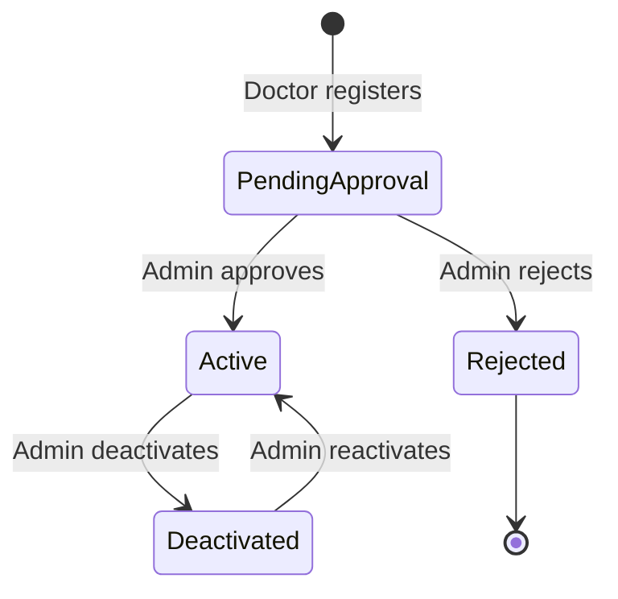
```mermaid
stateDiagram-v2
    [*] --> PendingApproval : Doctor registers
    PendingApproval --> Active : Admin approves
    PendingApproval --> Rejected : Admin rejects
    Active --> Deactivated : Admin deactivates
    Deactivated --> Active : Admin reactivates
    Rejected --> [*]
```

## 3.6 Class Diagram

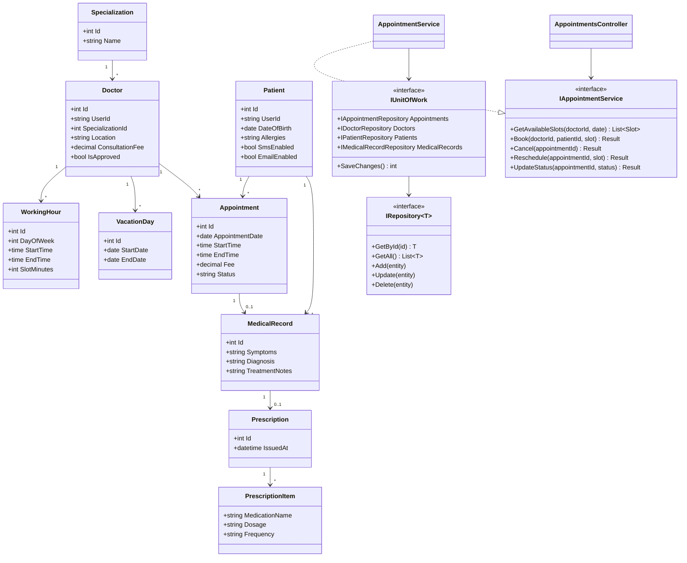
```mermaid
classDiagram
    class Specialization {
        +int Id
        +string Name
    }
    class Doctor {
        +int Id
        +string UserId
        +int SpecializationId
        +string Location
        +decimal ConsultationFee
        +bool IsApproved
    }
    class Patient {
        +int Id
        +string UserId
        +date DateOfBirth
        +string Allergies
        +bool SmsEnabled
        +bool EmailEnabled
    }
    class WorkingHour {
        +int Id
        +int DayOfWeek
        +time StartTime
        +time EndTime
        +int SlotMinutes
    }
    class VacationDay {
        +int Id
        +date StartDate
        +date EndDate
    }
    class Appointment {
        +int Id
        +date AppointmentDate
        +time StartTime
        +time EndTime
        +decimal Fee
        +string Status
    }
    class MedicalRecord {
        +int Id
        +string Symptoms
        +string Diagnosis
        +string TreatmentNotes
    }
    class Prescription {
        +int Id
        +datetime IssuedAt
    }
    class PrescriptionItem {
        +string MedicationName
        +string Dosage
        +string Frequency
    }
    class IRepository~T~ {
        <<interface>>
        +GetById(id) T
        +GetAll() List~T~
        +Add(entity)
        +Update(entity)
        +Delete(entity)
    }
    class IUnitOfWork {
        <<interface>>
        +IAppointmentRepository Appointments
        +IDoctorRepository Doctors
        +IPatientRepository Patients
        +IMedicalRecordRepository MedicalRecords
        +SaveChanges() int
    }
    class IAppointmentService {
        <<interface>>
        +GetAvailableSlots(doctorId, date) List~Slot~
        +Book(doctorId, patientId, slot) Result
        +Cancel(appointmentId) Result
        +Reschedule(appointmentId, slot) Result
        +UpdateStatus(appointmentId, status) Result
    }
    class AppointmentService
    class AppointmentsController

    Specialization "1" --> "*" Doctor
    Doctor "1" --> "*" WorkingHour
    Doctor "1" --> "*" VacationDay
    Doctor "1" --> "*" Appointment
    Patient "1" --> "*" Appointment
    Patient "1" --> "*" MedicalRecord
    Appointment "1" --> "0..1" MedicalRecord
    MedicalRecord "1" --> "0..1" Prescription
    Prescription "1" --> "*" PrescriptionItem
    AppointmentsController --> IAppointmentService
    AppointmentService ..|> IAppointmentService
    AppointmentService --> IUnitOfWork
    IUnitOfWork --> IRepository~T~
```

---

# 4. UI/UX Design & Prototyping

## 4.1 Wireframes & Mockups

The interface has 12 screens that cover the three roles. The screens are also built as a working prototype (a single-page website with sample data).

### Public screens

**Login (patient or doctor)**

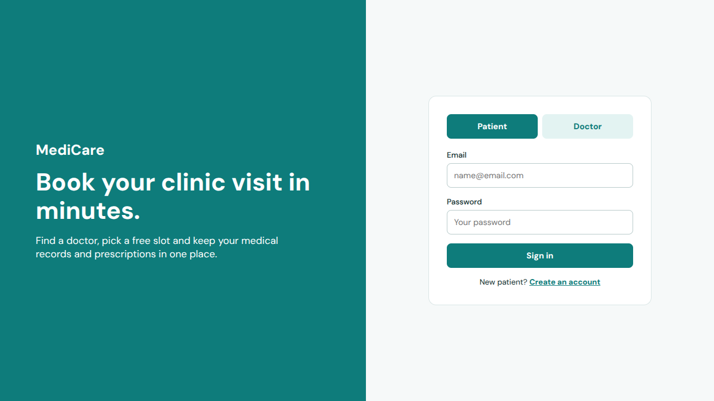

**Patient registration**

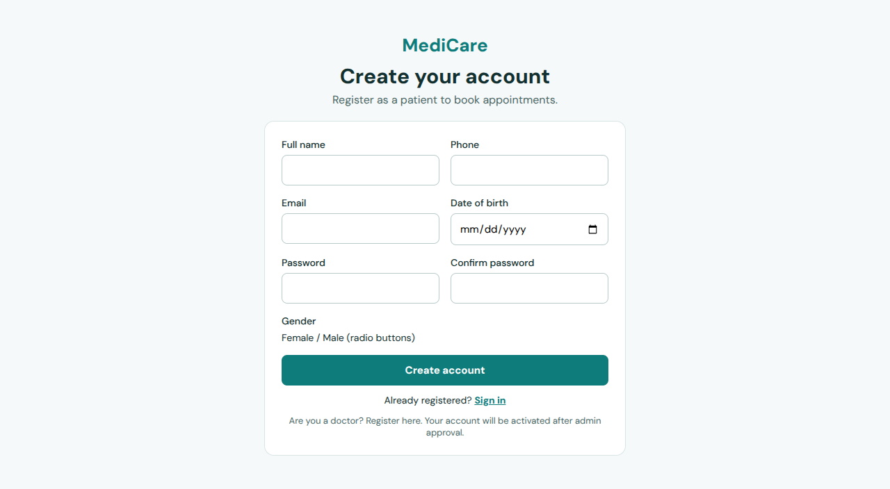

### Patient screens

**Doctor search with filters**

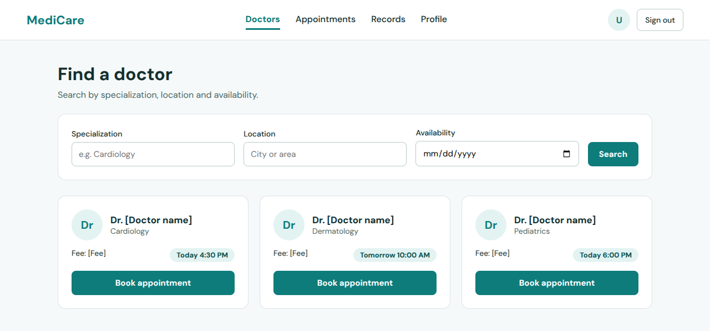

**Appointment booking with free and booked slots**

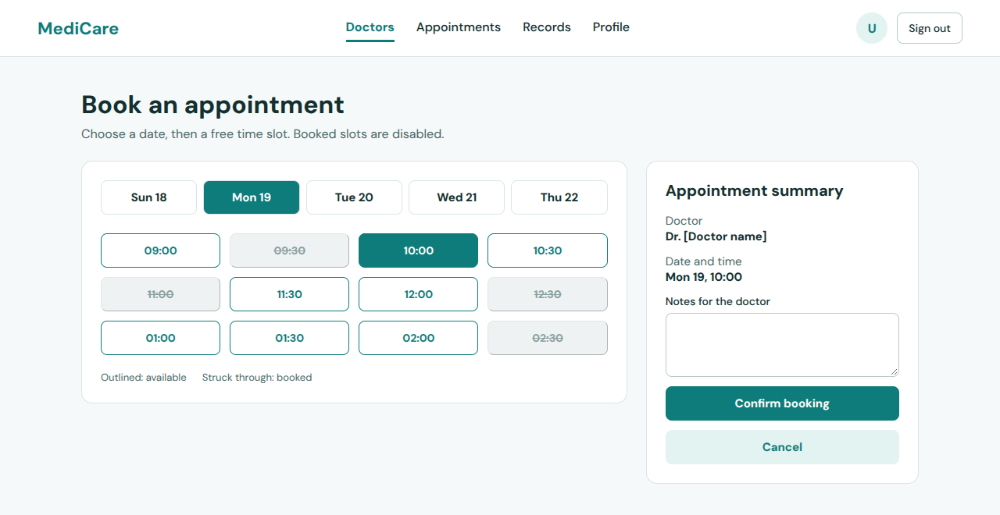

**My appointments: upcoming and history**

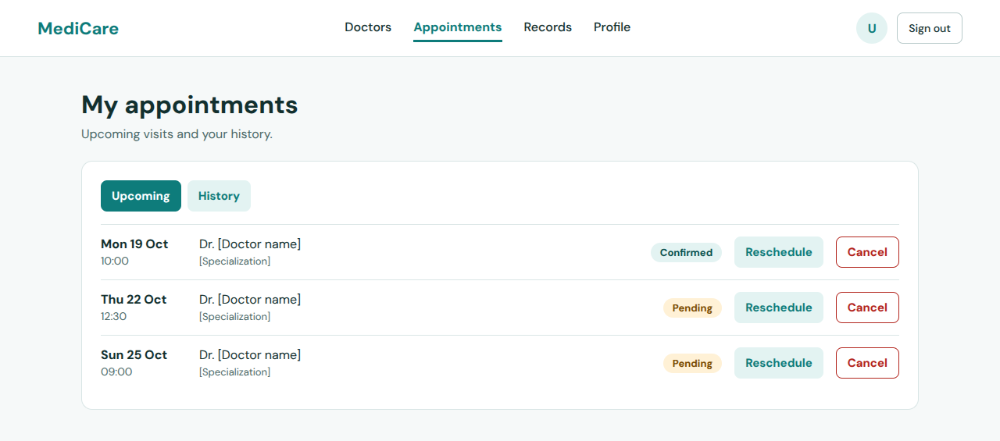

**Medical records and prescriptions**

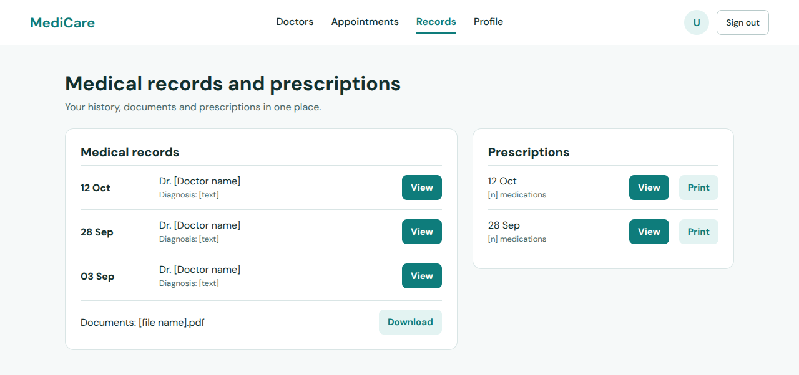

**Profile and notification preferences**

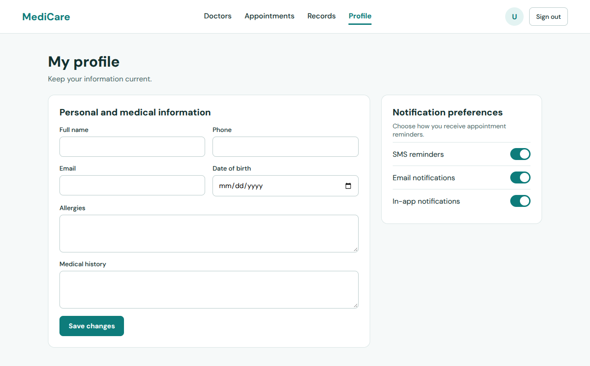

### Doctor screens

**Doctor dashboard: confirm or reject requests**

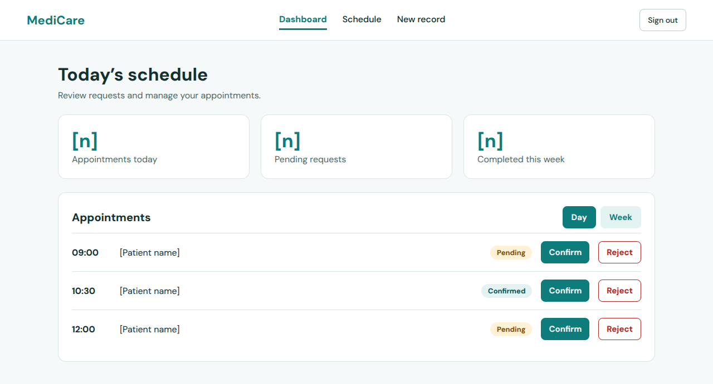

**Working hours and vacation days**

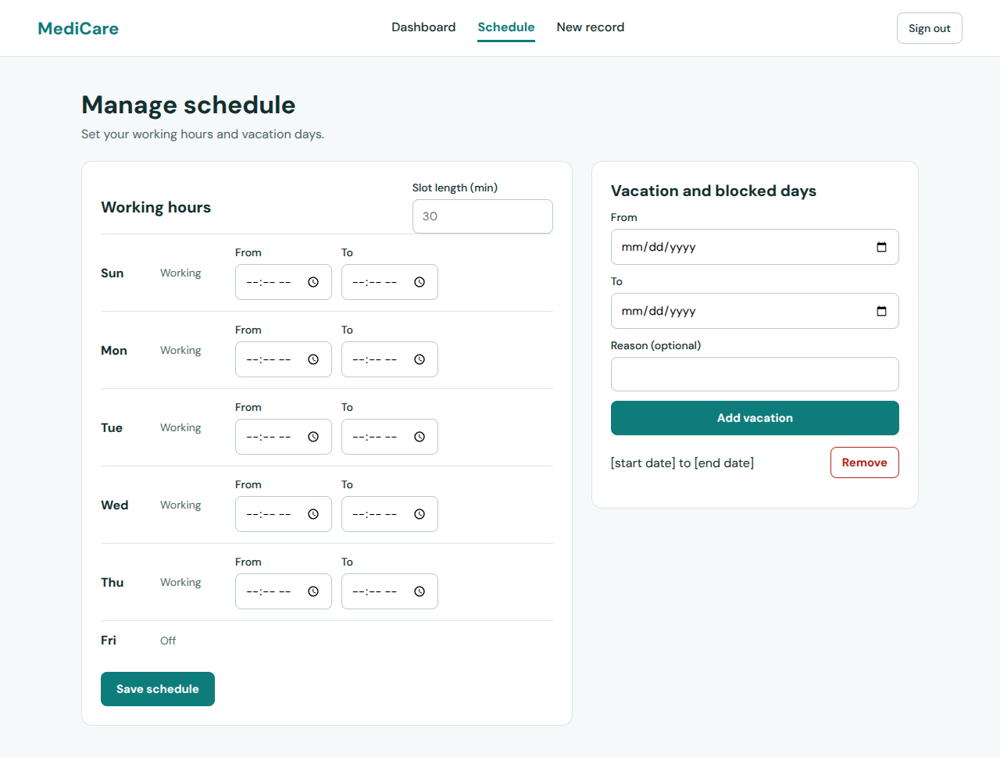

**Medical record and prescription**

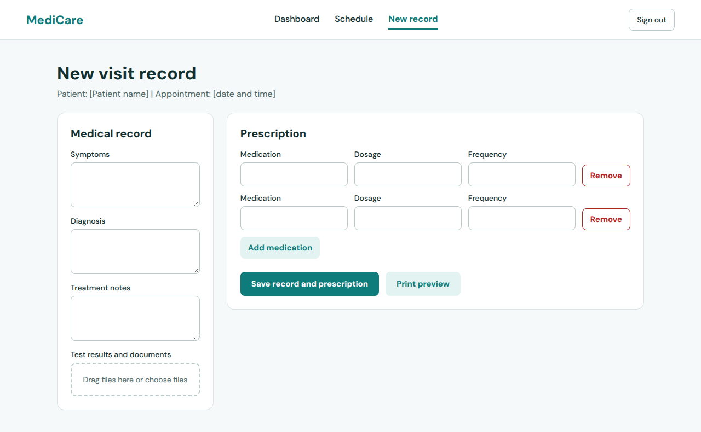

### Admin screens

**Admin dashboard: statistics, chart and doctor approvals**

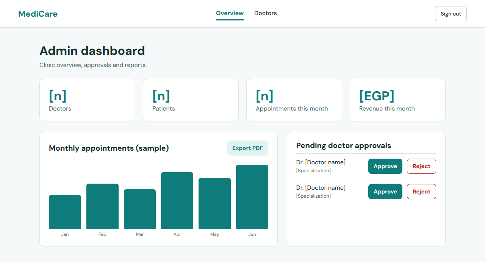

**Manage doctors**

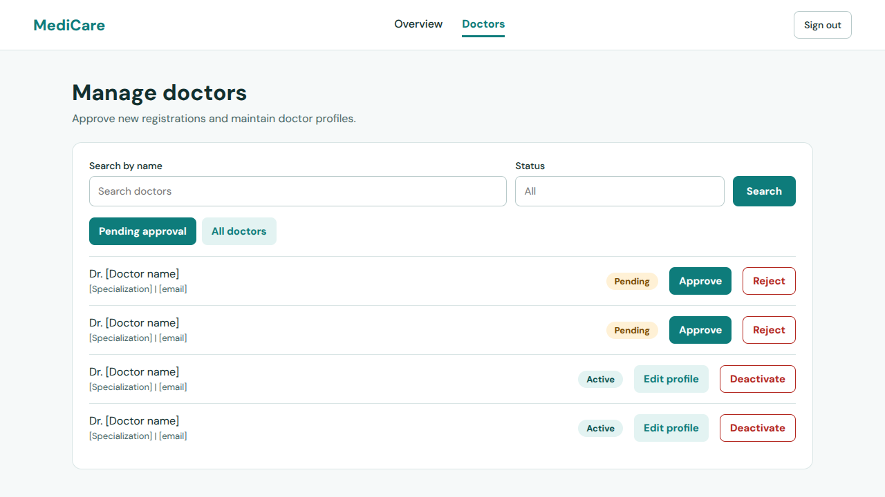

---

## 4.2 UI/UX Guidelines

**Design principles**
- **Simple and clear:** one main action per screen (for example, "Book appointment").
- **Consistent:** the same navigation bar, buttons and card style on every page.
- **Safe actions:** destructive actions (cancel, reject) use a red outline, and confirmations use the main teal color.
- **Clear feedback:** every form shows an error message next to the invalid field, and success messages after saving.
- **Responsive:** Bootstrap 5 grid, works on desktop and mobile.

**Color scheme**

| Use | Color |
|---|---|
| Primary (buttons, links, brand) | `#0E7C7B` teal |
| Primary light (backgrounds, tags) | `#E3F3F2` |
| Text | `#12302F` |
| Secondary text | `#4A6766` |
| Page background | `#F6F9F9` |
| Borders | `#D9E5E5` |
| Pending status | `#FFF1D6` background, `#7A4B00` text |
| Danger (reject, cancel) | `#B3261E` |

A dark mode uses the same colors on a dark background.

**Typography**
- Font: **DM Sans** (400 regular, 500 medium, 700 bold), with a sans-serif fallback.
- Page title 32px, section title 20px, body 15px, small text 13 to 14px.

**Accessibility**
- Text and background colors keep a high contrast ratio.
- Buttons and inputs are at least 44px high so they are easy to tap.
- Every input has a visible label.
- Status is shown with text and color together, not color alone.
- All pages work with the keyboard (tab order, visible focus).
- Dark/light mode toggle.

---

# 5. System Deployment & Integration

## 5.1 Technology Stack

- **Backend:** ASP.NET Core MVC, Entity Framework Core, ASP.NET Identity
- **Frontend:** Razor Views, Bootstrap 5, FullCalendar.js, Chart.js
- **Database:** SQL Server (Azure SQL Database in production)
- **Real-time:** SignalR (Azure SignalR Service in production)
- **External services:** Twilio (SMS), SendGrid (email)
- **Cloud:** Microsoft Azure App Service
- **Source control and CI/CD:** GitHub and GitHub Actions

## 5.2 Component Diagram

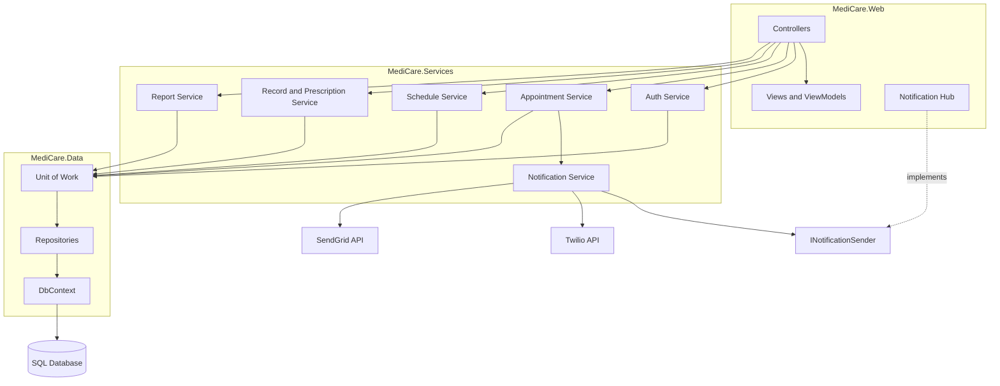
```mermaid
flowchart TB
    subgraph Web ["MediCare.Web"]
        Ctrl["Controllers"]
        Views["Views and ViewModels"]
        Hub["Notification Hub"]
    end
    subgraph Services ["MediCare.Services"]
        Auth["Auth Service"]
        Appt["Appointment Service"]
        Sched["Schedule Service"]
        Rec["Record and Prescription Service"]
        Notif["Notification Service"]
        Rep["Report Service"]
    end
    subgraph Data ["MediCare.Data"]
        Repos["Repositories"]
        UoW["Unit of Work"]
        Ctx["DbContext"]
    end
    Ctrl --> Views
    Ctrl --> Auth
    Ctrl --> Appt
    Ctrl --> Sched
    Ctrl --> Rec
    Ctrl --> Rep
    Appt --> Notif
    Notif --> INotif["INotificationSender"]
    Hub -.->|implements| INotif
    Auth --> UoW
    Appt --> UoW
    Sched --> UoW
    Rec --> UoW
    Rep --> UoW
    UoW --> Repos
    Repos --> Ctx
    Notif --> Twilio["Twilio API"]
    Notif --> SendGrid["SendGrid API"]
    Ctx --> SQL[("SQL Database")]
```

## 5.3 Deployment Diagram

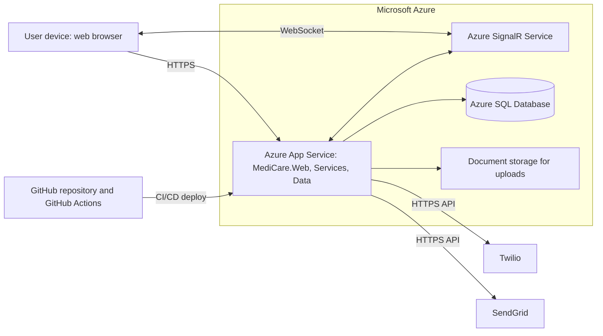
```mermaid
flowchart LR
    Client["User device: web browser"]

    subgraph Azure ["Microsoft Azure"]
        App["Azure App Service: MediCare.Web, Services, Data"]
        SignalR["Azure SignalR Service"]
        SQL[("Azure SQL Database")]
        Files["Document storage for uploads"]
    end

    Twilio["Twilio"]
    SendGrid["SendGrid"]
    GH["GitHub repository and GitHub Actions"]

    Client -->|"HTTPS"| App
    Client <-->|"WebSocket"| SignalR
    App <--> SignalR
    App --> SQL
    App --> Files
    App -->|"HTTPS API"| Twilio
    App -->|"HTTPS API"| SendGrid
    GH -->|"CI/CD deploy"| App
```

---

# 6. Additional Deliverables

## 6.1 API Documentation

MediCare is an MVC web application and does not expose a public API, so no external API documentation is needed. The pages use a few internal JSON endpoints (called with AJAX by FullCalendar.js and Chart.js):

| Endpoint | Method | Purpose |
|---|---|---|
| `/Appointments/GetSlots?doctorId=&date=` | GET | Returns free slots for the calendar |
| `/Appointments/Book` | POST | Creates an appointment |
| `/Appointments/Cancel/{id}` | POST | Cancels an appointment |
| `/Doctors/Search?specialization=&location=` | GET | Returns filtered doctors |
| `/Admin/Statistics?month=` | GET | Returns chart data |

## 6.2 Testing & Validation

**Unit tests** (xUnit): booking rules, conflict detection, slot generation from working hours, status changes, prescription creation.

**Integration tests:** repositories and Unit of Work against a test database, and the booking flow from controller to database.

**Concurrency test:** two requests book the same slot at the same time. Expected result: exactly one succeeds.

**Security checks:** a patient cannot open another patient's data by changing the URL, and role restrictions are enforced on the server.

**User acceptance testing (UAT):**
1. A patient registers, searches for a doctor and books an appointment.
2. The doctor receives a real-time notification and confirms it.
3. The patient receives the confirmation and a reminder.
4. The doctor creates a record and a prescription, and the patient views it.
5. The admin approves a doctor and exports a report.

Each scenario is run with real users from outside the team, and the results (pass or fail, and comments) go into the UAT report.

## 6.3 Deployment Strategy

- **Hosting:** Azure App Service for the web application, Azure SQL Database for data, and Azure SignalR Service for real-time features.
- **Pipeline (GitHub Actions):** on every push, build the solution, run the tests, then deploy to Azure when the change is merged to `main`.
- **Environments:** local development, then the Azure production app. A staging slot can be added if time allows.
- **Database changes:** applied with EF Core migrations.
- **Secrets:** Twilio, SendGrid and database keys are stored in Azure app settings, never in the repository.
- **Scaling:** scale the App Service up (bigger plan) or out (more instances) when load grows, with Azure SignalR Service handling the connections.
- **Backup and monitoring:** automatic Azure SQL backups and Azure monitoring for uptime and response time (KPIs 1 and 2).
